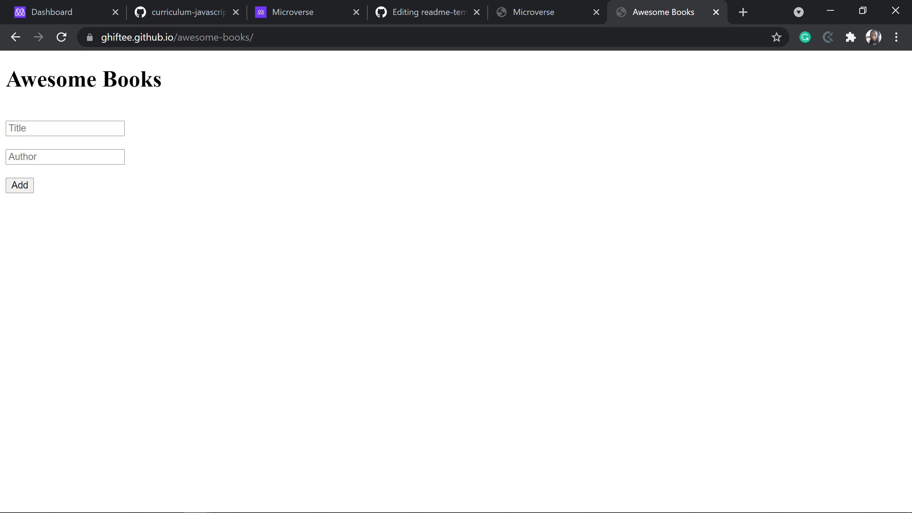

# Awesome Books : Plain Javascript with Objects

> This is a creation of a Javascript website which updates and removes books as the user pleases. 

Additional description about the project and its features.

## Built With

- HTML, Javascript

## Live Demo

[Live Demo Link](https://ghiftee.github.io/awesome-books/)

## Getting Started

To get a local copy up and running:
You should have basic knowledge of HTML and Javascript, a text editor and chrome browser.

## Authors

👤 **Author1**

- GitHub: [@githubhandle](https://github.com/ghiftee)
- Twitter: [@twitterhandle](https://twitter.com/ghiftee)
- LinkedIn: [LinkedIn](https://linkedin.com/in/giftuwhubetine)

👤 **Author2**

- GitHub: [@githubhandle](https://github.com/akasharojee)
- Twitter: [@twitterhandle](https://twitter.com/akasharojee)
- LinkedIn: [LinkedIn](https://linkedin.com/in/akasharojee)

## 🤝 Contributing

Contributions, issues, and feature requests are welcome!

Feel free to check the [issues page](../../issues/).

## Show your support

Give a ⭐️ if you like this project!

## 📝 License

This project is [MIT](./MIT.md) licensed.